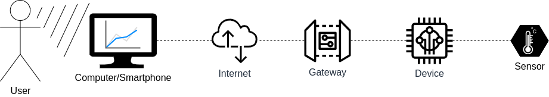
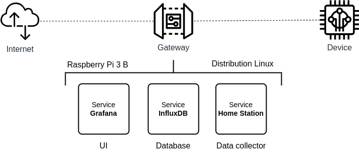
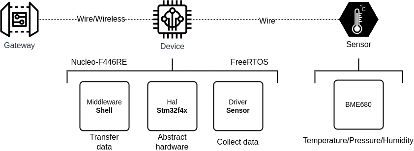

# HOME STATION

The home station is a hobbist project and in no way an industrial project. The goal of this project is to have fun with state of art on embedded system.

## Project overview
The project aims to develop a system that allows users to access real-time or historical data collected directly from their homes. This data is sourced from various inputs, such as local weather conditions or sensors installed in the home, such as temperature and humidity. The system is designed to centralize this information and make it easily accessible through an intuitive user interface, enabling better management of the home environment.

## System view
The user can visualize data through a UI directly on a computer or a smartphone.
Data are gathering from sensor to UI through a gateway and a device as following :

The Home Station system is composed of two main components: a gateway and a device.
The gateway serves as a bridge between the device and the internet for collecting data and storing it in a database.
It ensures secure and reliable communication for remote access to the data.
The device gathers physical data from various sensors, such as temperature, pressure, and humidity.
This allows for intelligent data acquisition, transforming raw sensor inputs into meaningful information for the user.

## Functional view
In technical terms, consider software development on the two components : gateway and device.
To have a better view of the component follow the below description.

### Gateway
This system is based on a Raspberry Pi model 3B (not critical, need only internet connection).
The OS is a Linux distribution and running SystemD service as program.
Three services are running :
- Grafana service for UI
- InfluxDB service for database
- Home station service for custom program to gather data and store it on database

Go to the folder **gateway** to see the integration of tool on the system.

### Device
This system is based on a Nucleo-F446RE from ST-Microelectronics connecting to the sensor BME680.
Some libraries are used as FreeRTOS kernel and STM32F4x HAL (Hardware Abstraction Layer).

Go to the folder **device** to see the integration of firmware on the system.

## Repository arborescence
On the root of repository, the organization is the following :
- **.github** : contains CI/CD configuration files for Github Actions.
- **documentation** : contains some files for the project.
- **device** : contains firmware development for device system.
- **gateway** : contains program development for gateway system.
- **testbench** : contains an automated test bench for gateway and device

## License
Check the License file to have terms.